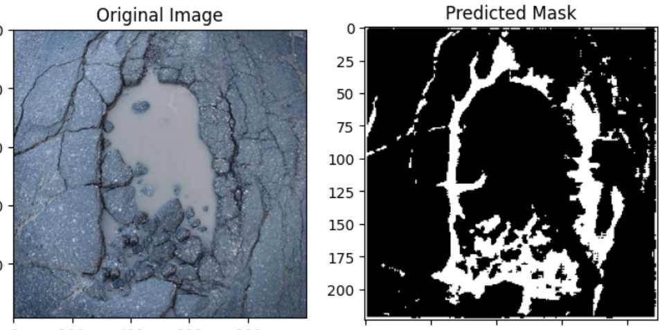
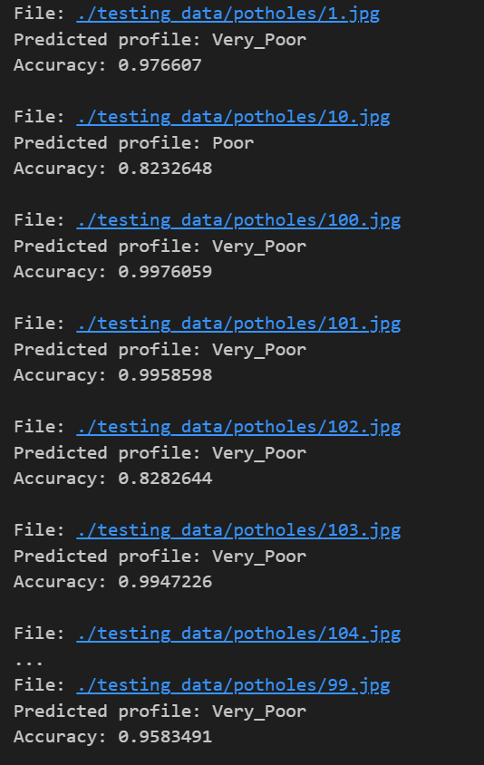

# Pothole-Detection-and-Crack-Segmentation
## Intended for Autonomous vehicles to predict state of potholes and crack types. Pothole detection and classification is the 1st module. The 2nd is crack segmentation. Detection makes use of PySpark to parallelize training and predictions, improving speeds.

### Segmentation module

### Classification module

